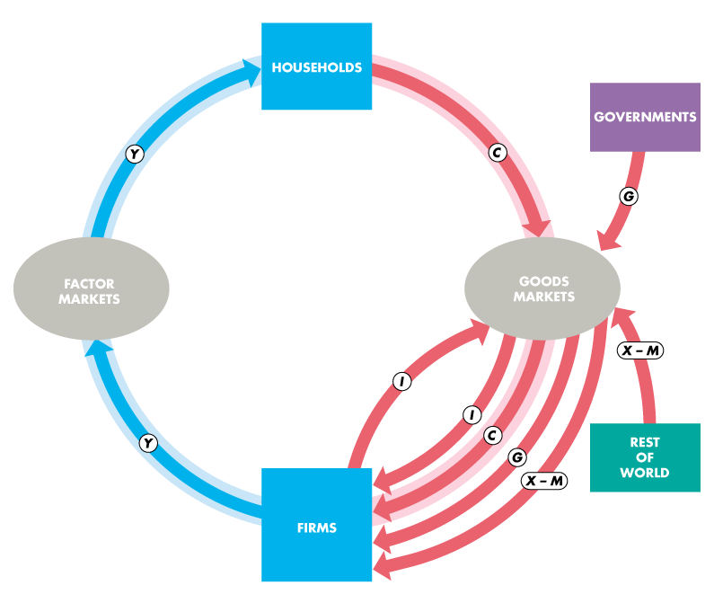

## Chapter 20. Measuring GDP and Economic Growth

---

####_Table of Contents_

[TOC]

## Gross Domestic Product

- **_Definition._** **GDP (Gross Domestic Product)**

  ==_The market value of the final goods and services produced within a country in a given time period._==

  - <u>*Market Value*</u>: we use dollars to measure the total production.
  - *<u>Final Goods and Services</u>*: bought by its final user. This contradicts with an *intermediate good (or service)*, which is an item that is produced by one firm, bought by another firm, and used as a component of a final good or service. This avoids *double counting*.
  - <u>*Produced Within a Country*</u>: for example, t-shirts made in China are sold in Canada, but they are not part of Canada's GDP.
  - *<u>Given Time Period</u>*: usually either quarterly or annually. 

- GDP measures not only the value of total production but also total income and total expenditure; it shows the direct link between productivity and living standards. 

---

#### Circular Flow of Expenditure and Income

- ==The economy consists of *households, firms, governments,* and *the rest of the world.*==
- <u>*Households and Firms*</u>
  - <u>Factor Markets</u>: firms pay income to households
    - Money: Firm $\rightarrow$ Household; Goods/Services: Household $\rightarrow$ Firm
      - Wages for labor services
      - Interest for the user of capital
      - Rent for the use of land
      - Entrepreneurship receives profit
    - **_Remark._** *Retained earnings*: Profits that are not distributed to households but still are part of the household sector's income. You can think of this as being income that households save and lend back to firms. 
    - The blue flow labeled $Y$ shows the total income -- "***aggregate income***". 
  - <u>Goods Markets</u>: households buy consumer goods and services from firms
    - Money: Household $\rightarrow$ Firm; Goods/Services: Firm $\rightarrow$ Households.
    - The total payment for consumer goods and services is ***consumption expenditure***, shown by the red flow labeled $C$.
    - The purchase of new plant, equipment, and buildings and additions to inventories are ***investment***, shown by the red flow labeled $I$. 
- <u>Governments</u> 
  - Governments buy goods and services from firms and their expenditure on goods and services is called ***government expenditure***, represented by the red flow $G$. 
- <u>Rest of the world</u>
  - The value of ***exports*** minus the value of ***imports*** is called ***net exports***, represented by the red flow $X - M$. 

---

#### GDP Equals Expenditure Equals Income

- GDP can be measured in two ways: by the total expenditure on goods and services or by the total income and earned producing goods and services. 

- The total expenditure -- ***aggregate expenditure*** -- is the sum of the red flows. 

- Aggregate income is equal to the total amount paid for the services of the factors of production used to produce final goods and services, represented by the blue arrows.

- Because firms pay out as incomes (including retained profits) everything they receive from the sale of their output, ==***aggregate income equals aggregate expenditure.***== That is, red arrow equals blue arrow.

- ***Formula.*** 

  #### 							$$ Y = C + I + G + X - M$$ 

---

#### "Gross" Domestic Product

- "Gross" means before subtracting the depreciation of capital. The opposite of gross is **net**. 
- ***Depreciation*** is the decrease in the value of a firm's capital that results from wear and tear and obsolescence.
- The total amount spent both buying new capital and replacing depreciated capital is called ***gross investment***. The amount by which the value of capital increases is called ***net investment***. ==Net investment equals gross investment minus depreciation.==

---

## Measuring Canada's GDP

- The Expenditure Approach: $C + I + G + X - M$
- The Income Approach: $Y$

#### Nominal GDP and Real GDP

- ***Definition.*** ==**Real GDP** is the value of final goods and services produced in a given year when _valued at the prices of a reference base year_. **Nominal GDP** is the value of final goods and services produced in a given year when valued at the prices of that year.== We usually use GDP to denote the nominal GDP.

#### Calculating Real GDP

- ***Formula.*** ==For each item, we multiply the quantity produced in that year by its price in the base year to get the real GDP.== 

---

## The Uses and Limitations of Real GDP

- Economists use estimates of real GDP for two main purposes:

  - To compare the standard of living over time.

    - ***Real GDP per person***
    - ***Potential GDP*** is the maximum level of real GDP that can be produced while avoiding shortages of labor, capital, land, and entrepreneurial ability that would bring rising inflation. 
    - We call the fluctuations in the pace of expansion of real GDP the ***business cycle***. 
      - Every cycle has two phases: ***expansion*** and ***recession***.
      - Every cycle has two turning points: ***peak*** and ***trough***. 

  - To compare the standard of living across countries.

    - ***PPP***: _purchasing power parity_ - the same prices for both countries. 

      > PPP is an economic theory that states that the exchange rate between two currencies is equal to the ratio of the currencies' respective purchasing power. This concept can be useful for making comparisons between countries.

- There are factors that influence the standard of living but are not part of GDP:

  - Household production: e.g. chores
  - Underground economic activity: e.g. drugs
  - Health and life expectancy
  - Leisure time
  - Security
  - Environmental quality
  - Political freedom and social justice

- Human Development Index -- ***HDI***

  - Measures the average achievements in a country in three basic dimensions of human development.

    - A long and healthy life as measured by life expectancy
    - Knowledge as measured by adult literacy rate and the gross enrolment rate
    - Decent standard of living as measured by GDP per capita

  - ***Formula***

    ​			$$\text{HDI} = \frac{1}{3} LE + \frac{1}{3}EDU + \frac{1}{3} GDP_c$$

    ​